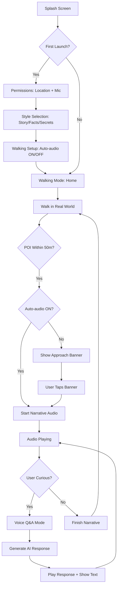
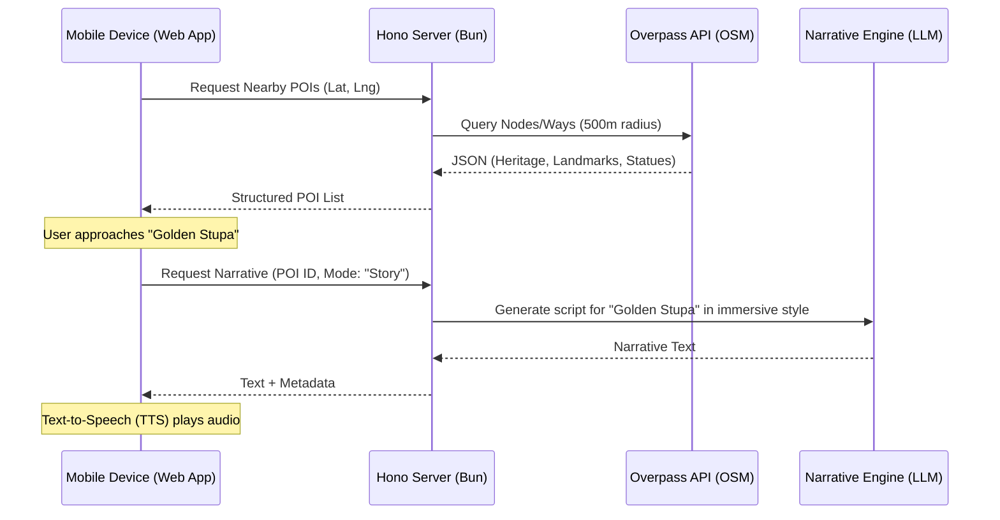

# WanderVoice — Architecture & Flow

This document details the technical stack and the application flow of WanderVoice, connecting the underlying infrastructure to the user experience.

---

## 1. Technical Stack (The "Stacks")

WanderVoice is built on a high-performance monorepo architecture designed for real-time, location-aware interactions.

### Core Infrastructure
- **Runtime**: [Bun](https://bun.sh/) — Used for both development and production for maximum performance.
- **Monorepo**: [Turborepo](https://turbo.build/) — Manages the workspace containing `apps` and `packages`.
- **Tunneling**: [Ngrok](https://ngrok.com/) — Bridges local development to the physical mobile device for real-world walking tests (via `tunnel.ts`).

### Applications (`/apps`)
- **Web (Frontend)**: [Next.js (App Router)](https://nextjs.org/)
  - **Styling**: [Tailwind CSS v4](https://tailwindcss.com/) (using the new JIT engine).
  - **Icons**: [Lucide React](https://lucide.dev/).
  - **Components**: [shadcn/ui](https://ui.shadcn.com/) (housed in `@wandervoice/ui`).
  - **State**: Zustand (for reactive location and audio state).
- **Server (Backend)**: [Hono](https://hono.dev/)
  - **Runtime**: Bun (native performance).
  - **Features**: RESTful API, Overpass API proxying for POI data, AI narrative generation.

### Shared Packages (`/packages`)
- **@wandervoice/ui**: Shared React components and global design system.
- **@wandervoice/db**: [Drizzle ORM](https://orm.drizzle.team/) with [PostgreSQL/Supabase](https://supabase.com/).
- **@wandervoice/env**: Type-safe environment variable management using Zod.
- **@wandervoice/config**: Shared ESLint and TypeScript configurations.

---

## 2. Application Flow (The "Flow")

### User Lifecycle
The following diagram illustrates the user's journey from first launch to the core walking loop.

### Data & Logic Flow
How information moves through the stack to create the "Wander" experience.

---

## 3. How Stack & Flow Connect

| Layer | Technical Choice | Flow Benefit |
| :--- | :--- | :--- |
| **Runtime** | Bun | Sub-second latency for Overpass queries and API responses, critical for real-time walking cues. |
| **Monorepo** | Turborepo | Fast builds and shared types between Web and Server ensure the "POI" object is consistent across the journey. |
| **Backend** | Hono | Lightweight enough to run as an Edge function or on a small instance, reducing "TTB" (Time to Blue-dot) updates. |
| **Frontend** | Next.js | App Router allows for smooth transitions between "Walking Mode" and "POI Detail" without full page reloads. |
| **Database** | Drizzle | Type-safe schema for "Gems Found" ensures Elena's history is never lost during her walk. |
| **Tunnel** | Ngrok | Essential for the **Flow**; allows testing the actual GPS hardware on a phone while the code runs on a laptop. |

---
*Created by Antigravity — System Architect*
